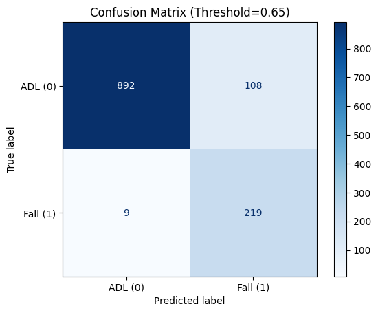
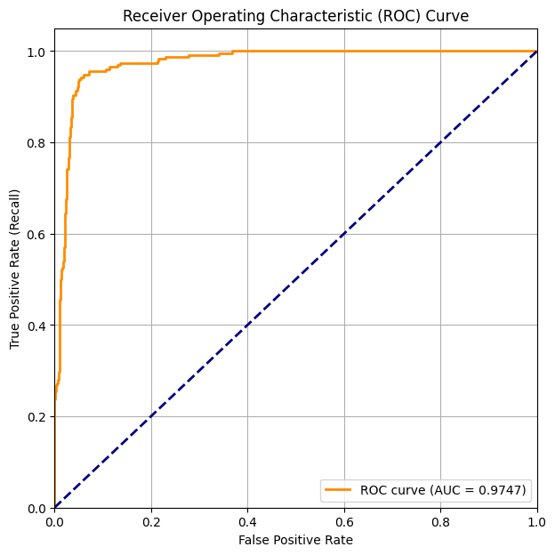
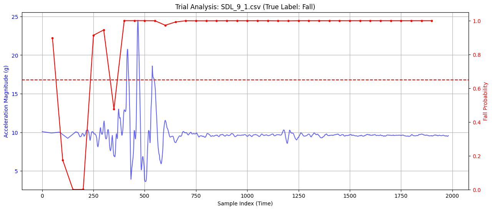
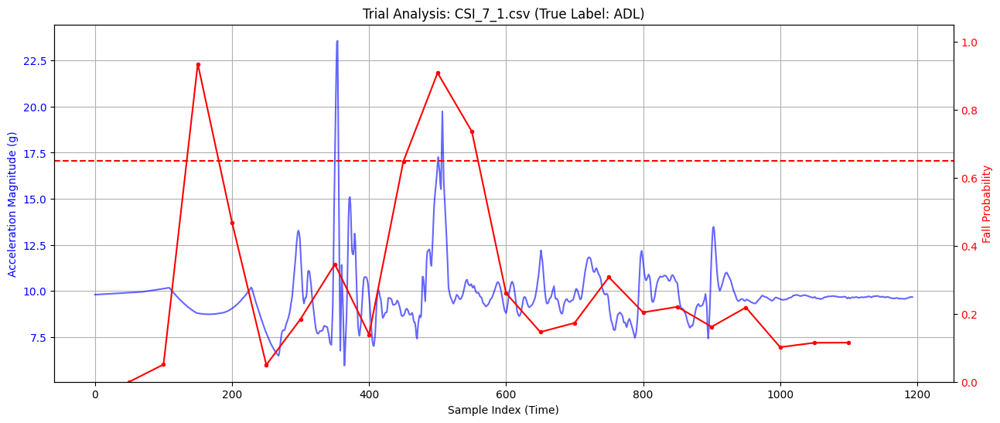
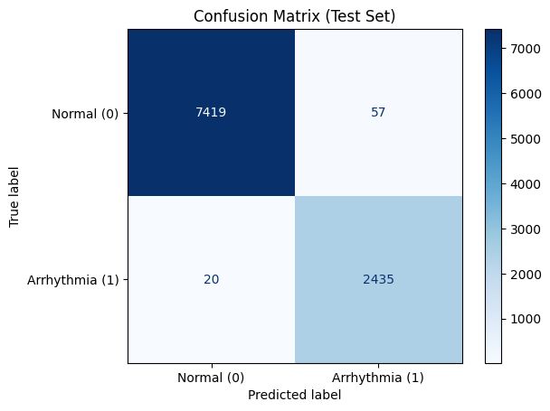
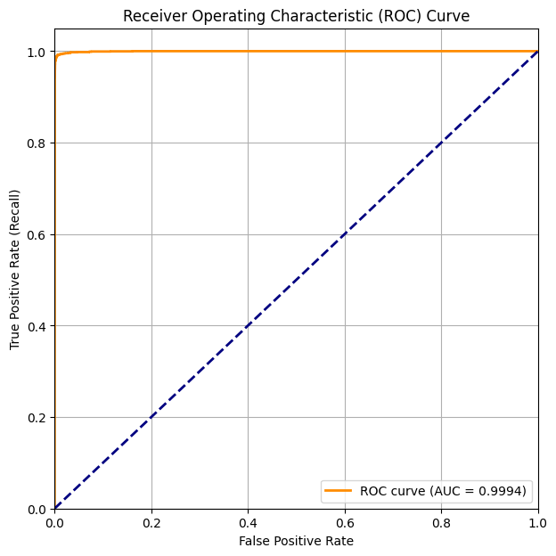
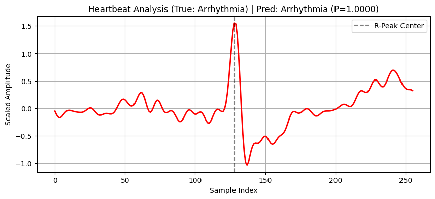
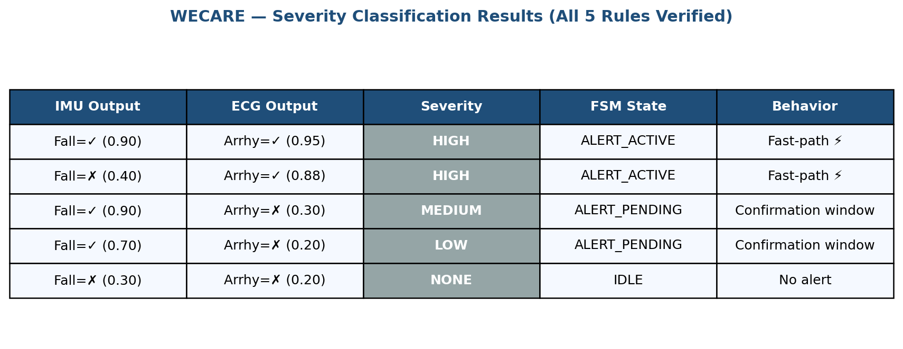
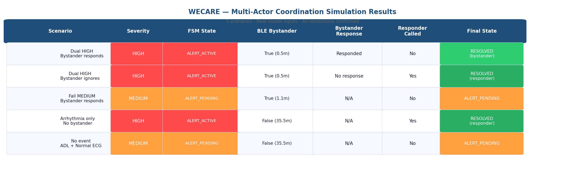
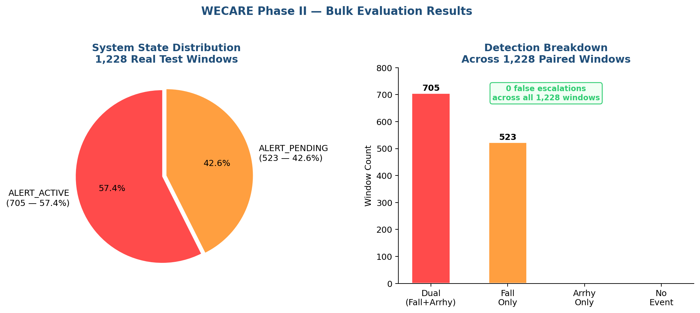

# 🫀 WECARE — Wearable Emergency Cardiac and Fall Response System

<div align="center">


**A wearable AI system that detects cardiac emergencies and falls in real time,
then orchestrates a coordinated multi-actor emergency response using BLE proximity
detection and LLM-generated first-aid instructions.**

[Overview](#-overview) • [Architecture](#-architecture) • [Results](#-results) • [Setup](#-setup) • [Demo](#-demo) • [Roadmap](#-roadmap)

</div>

---

## 🎯 Overview

WECARE addresses a critical gap in wearable health technology: **detection exists, but coordinated response does not.**

Commercial wearables (Apple Watch, Fitbit) detect falls or arrhythmias and call 911 — but no system currently:
- Discovers nearby bystanders and delivers contextual first-aid instructions
- Fuses simultaneous fall + cardiac signals into a unified severity decision
- Routes different information to different actors (patient, bystander, paramedic)
- Operates entirely on-device without cloud dependency

WECARE is built in two phases:

| Phase | Scope | Deliverable |
|-------|-------|-------------|
| **Phase I** | On-device 1D CNN detection | Fall: F1=0.81 · Arrhythmia: F1=0.99 |
| **Phase II** | Orchestration layer | FSM · BLE proximity · LLM guidance · Multi-actor coordination |

---

## 🏗 Architecture

```
┌──────────────────────────────────────────────────────────────┐
│                      SENSOR INPUTS                           │
│     IMU (100×9 window)              ECG (256-sample beat)    │
└──────────────┬───────────────────────────┬───────────────────┘
               ▼                           ▼
┌──────────────────────────────────────────────────────────────┐
│               DETECTION MODULE  (Phase I)                    │
│   1D CNN → fall_prob           1D CNN → arrhy_prob           │
│   F1=0.81 / 0.033ms            F1=0.99 / 0.018ms            │
└──────────────────────────┬───────────────────────────────────┘
                           ▼
┌──────────────────────────────────────────────────────────────┐
│                  SEVERITY CLASSIFIER                         │
│  Fall + Arrhythmia → HIGH  ← dual-signal fast-path           │
│  Arrhythmia alone  → HIGH                                    │
│  Fall (≥0.85)      → MEDIUM  ·  Fall (0.65–0.85) → LOW      │
└──────────────────────────┬───────────────────────────────────┘
                           ▼
┌──────────────────────────────────────────────────────────────┐
│           ORCHESTRATION ENGINE  (5-State FSM)                │
│   IDLE → PENDING → ACTIVE → ESCALATING → RESOLVED           │
│                 ↑ Dual HIGH skips PENDING (fast-path)        │
└───────────────┬──────────────────────┬───────────────────────┘
                ▼                      ▼
    ┌───────────────────┐   ┌──────────────────────────────┐
    │   BLE PROXIMITY   │   │    LLM INSTRUCTION GEN       │
    │   RSSI ≥ −70 dBm  │   │  llama-3.3-70b · T=0.1      │
    │   (Apple EN spec) │   │  AHA-aligned · 5-step output │
    └─────────┬─────────┘   └──────────────┬───────────────┘
              └──────────────┬─────────────┘
                             ▼
┌──────────────────────────────────────────────────────────────┐
│                     RESPONSE LAYER                           │
│  👤 Patient    → audio/haptic alert on wearable              │
│  🧑 Bystander  → BLE push + LLM step-by-step instructions   │
│  🚑 Responder  → event summary on escalation                 │
└──────────────────────────────────────────────────────────────┘
```

---

## ✨ Key Innovations

### 1️⃣ Dual-Signal Fast-Path
When fall AND arrhythmia are detected simultaneously, the system **bypasses the 5-second confirmation window** and jumps directly to `ALERT_ACTIVE`. Simultaneous fall + cardiac event indicates syncope or sudden cardiac arrest — where any delay is life-threatening.

```
Standard path:  IDLE → PENDING (5s wait) → ACTIVE
Fast-path:      IDLE ──────────────────→ ACTIVE  ← dual HIGH only
```

### 2️⃣ BLE Proximity Discovery (No GPS)
Inspired by Apple's COVID-19 Exposure Notification framework. Uses RSSI threshold **−70 dBm** (~10m) for bystander discovery — no GPS, no internet required.

```python
d = 0.89976 × (RSSI / TxPower)^7.7095 + 0.111   # Apple EN formula
```

### 3️⃣ LLM-Generated First-Aid Instructions
Runtime AHA-aligned guidance via constrained prompt. Instructions differentiate by event — dual events prioritize cardiac response and include AED guidance; fall-only events emphasize spinal precautions.

### 4️⃣ Multi-Actor Coordination
Three actors receive differentiated information routed by FSM state — not a single 911 call but a structured, tiered response.

---

## 📊 Results

### Phase I: Detection Performance

| Model | Accuracy | Precision | Recall | F1-Score | Latency |
|-------|----------|-----------|--------|----------|---------|
| **IMU — Fall Detection** | 0.9178 | 0.7029 | **0.9649** | **0.8133** | 0.033 ms |
| **ECG — Arrhythmia** | **0.9933** | 0.9834 | 0.9894 | **0.9864** | 0.018 ms |

Both models run well under the **40 ms real-time target** ✅

#### IMU Model — Confusion Matrix & ROC Curve

<table>
  <tr>
    <td align="center">
      
      <br/><em>Confusion Matrix — only 8 missed falls out of 228</em>
    </td>
    <td align="center">
      
      <br/><em>ROC AUC Curve</em>
    </td>
  </tr>
</table>

#### IMU Trial Visualizations

<table>
  <tr>
    <td align="center">
      
      <br/><em>Fall trial — model detects impact with sharp probability spike</em>
    </td>
    <td align="center">
      
      <br/><em>ADL (non-fall) trial — probability stays below threshold</em>
    </td>
  </tr>
</table>

#### ECG Model — Confusion Matrix & ROC Curve

<table>
  <tr>
    <td align="center">
      
      <br/><em>Confusion Matrix — near-perfect classification</em>
    </td>
    <td align="center">
      
      <br/><em>ROC AUC Curve</em>
    </td>
  </tr>
</table>

#### ECG Heartbeat Visualization

<div align="center">
  
  <br/><em>Single heartbeat analysis — model correctly classifies arrhythmia with high confidence</em>
</div>

---

### Phase II: Orchestration Results

#### Bulk Evaluation — 1,228 Real Test Windows

| Metric | Value |
|--------|-------|
| Windows evaluated | **1,228** |
| ALERT_ACTIVE (dual HIGH fast-path) | **705 / 1,228 (57.4%)** |
| ALERT_PENDING (confirmation window) | 523 / 1,228 (42.6%) |
| False escalations to responder | **0 / 1,228 (0.0%)** |
| Bystander notifications triggered | 705 / 1,228 |
| Mean fall prob — HIGH events | **0.997** |
| Mean arrhythmia prob — HIGH events | **0.981** |

#### Severity Classification

<div align="center">
  
  <br/><em>All 5 severity rules verified on real model outputs</em>
</div>

#### Multi-Actor Coordination Summary

<div align="center">
  
  <br/><em>5-scenario coordination simulation — all scenarios resolved correctly</em>
</div>

<div align="center">
  
  <br/><em>Bulk evaluation across 1,228 real test windows — 0 false escalations</em>
</div>

#### LLM Output — Dual HIGH Event

```
Event: Fall + Arrhythmia  |  Severity: HIGH  |  Bystander nearby (0.5m)

1. Call 911 immediately, put on speaker.
2. Tilt head back, lift chin to open airway.
3. Start CPR: 30 chest compressions, 2 rescue breaths.
4. Use AED if available — follow its voice instructions.
5. Continue CPR until help arrives.
Help is on the way.
```

#### Escalation Lifecycle

```
Cycle 1 → ALERT_ACTIVE      ← dual HIGH fast-path triggered
[60s — no bystander response]
Cycle 2 → ESCALATING        ← call_responder: True
[Paramedic] Acknowledged — dispatching unit
Cycle 3 → RESOLVED          ✅
```

---

### vs. Commercial Systems

| Capability | Phase I | Apple Watch | Life Alert | **Phase II** |
|------------|:-------:|:-----------:|:----------:|:------------:|
| Fall detection | ✅ | ✅ | ❌ | ✅ |
| Arrhythmia detection | ✅ | ✅ | ❌ | ✅ |
| Dual-signal fusion | ❌ | ❌ | ❌ | ✅ |
| BLE bystander discovery | ❌ | ❌ | ❌ | ✅ |
| Contextual instructions | ❌ | ❌ | ❌ | ✅ |
| Multi-actor routing | ❌ | ❌ | ❌ | ✅ |
| Edge-first (no cloud) | ✅ | ❌ | ❌ | ✅ |
| GPS-free | ✅ | ❌ | ❌ | ✅ |

---

## 📁 Repository Structure

```
wecare/
├── 📓 WECARE_IMU.ipynb              # Phase I: Fall detection
├── 📓 WECARE_ECG.ipynb              # Phase I: Arrhythmia detection
├── 📓 WECARE_Orchestration.ipynb    # Phase II: Full pipeline
├── 📄 requirements.txt
├── 📄 .gitignore
├── 📄 LICENSE
├── 📁 assets/                       # All images for README
│   ├── imu_confusion_matrix.png
│   ├── imu_roc_curve.png
│   ├── imu_fall_trial.png
│   ├── imu_adl_trial.png
│   ├── ecg_confusion_matrix.png
│   ├── ecg_roc_curve.png
│   ├── ecg_heartbeat.png
│   ├── severity_classification.png
│   ├── pipeline_output.png
│   └── coordination_summary.png
└── 📁 docs/
    ├── SETUP.md
    ├── ARCHITECTURE.md
    └── RESULTS.md
```

---

## ⚙️ Setup

### Prerequisites

- Google Account (Colab + Drive)
- Groq API key — free at [console.groq.com](https://console.groq.com)
- GPU recommended (T4 in Colab is free)

### 1. Get the Datasets

**IMU — MobiFall:**
Download from [Kaggle](https://www.kaggle.com/datasets/mrwellsdavid/mobifall) → upload CSVs to `MyDrive/AI4BM/IMU_MobiAct/Output/`

**ECG — MIT-BIH:**
Auto-downloads via `wfdb` when you run `WECARE_ECG.ipynb` — no manual download needed.

### 2. Run Phase I

```
WECARE_IMU.ipynb  →  Runtime → Run all  →  saves imu_model.pth
WECARE_ECG.ipynb  →  Runtime → Run all  →  saves ecg_model.pth
```

### 3. Add Your Groq API Key

In `WECARE_Orchestration.ipynb` Cell 6:
```python
groq_client = Groq(api_key="YOUR_GROQ_API_KEY_HERE")
```

### 4. Run Phase II

```
WECARE_Orchestration.ipynb  →  Runtime → Run all
```

Expected: 13 cells run successfully, bulk evaluation processes 1,228 windows.

📖 Full setup → [docs/SETUP.md](docs/SETUP.md)

---

## 🎬 Demo

### Force a HIGH Severity Event

```python
# WECARE_Orchestration.ipynb — Cell 7

fall_result = {"fall_prob": 0.92, "fall_detected": True}
ecg_result  = {"arrhythmia_prob": 0.95, "arrhythmia_detected": True}

engine = OrchestrationEngine()
action = engine.process(fall_result, ecg_result)
# → [IDLE] Dual-signal HIGH → skip PENDING → ACTIVE immediately

ble_result   = BLEProximityModule().scan(simulated_rssi=-55)
instructions = generate_instructions(
    "fall_and_arrhythmia", "HIGH",
    bystander_nearby=True,
    fall_prob=0.92, arrhy_prob=0.95
)
```

### Run on Real Dataset Windows

```python
# Cell 10 — real IMU + ECG test windows, genuine model outputs

for name, imu_pool, imu_i, ecg_pool, ecg_i in scenario_pairs:
    imu_window  = X_imu_test[imu_pool[imu_i]]
    ecg_segment = X_ecg_test[ecg_pool[ecg_i], :, 0]
    fall_result = detect_fall(imu_window)       # real model inference
    ecg_result  = detect_arrhythmia(ecg_segment)
    # → full pipeline on genuine predictions
```

---

## 🗺 Roadmap

- [x] Phase I: 1D CNN fall detection — F1 = 0.81
- [x] Phase I: 1D CNN arrhythmia detection — F1 = 0.99
- [x] Phase II: 5-state FSM orchestration engine
- [x] Phase II: Dual-signal fast-path
- [x] Phase II: BLE proximity module (Apple EN framework)
- [x] Phase II: LLM instruction generator (Groq API)
- [x] Phase II: Multi-actor coordination simulation
- [x] Phase II: Real test data pipeline — 1,228 windows evaluated
- [ ] Android app with live detection demo
- [ ] On-device LLM (Gemma 2B via MediaPipe)
- [ ] Real BLE broadcasting + scanning
- [ ] Hardware prototype (Raspberry Pi Zero 2W)
- [ ] Pilot study with human subjects

---

## 📚 Datasets

| Dataset | Modality | Source | Subjects | Samples |
|---------|----------|--------|----------|---------|
| MIT-BIH Arrhythmia Database | ECG | [PhysioNet](https://physionet.org/content/mitdb/1.0.0/) (real clinical) | 47 | ~10,000 segments |
| MobiFall_processed | IMU 9-channel | [Kaggle](https://www.kaggle.com/datasets/mrwellsdavid/mobifall) | 24 | ~40,000 windows |

> **Note on data pairing:** No public dataset simultaneously captures ECG and IMU during co-occurring fall and cardiac events. Test windows from each modality are paired systematically — standard methodology in systems research when combined ground truth does not exist.

---

## 🔬 Technical Details

<details>
<summary><b>IMU Model Architecture</b></summary>

```
Input: (100, 9) — 1 second of 9-channel IMU data

Conv1D(9→64,   kernel=7, pad=3) → ReLU → MaxPool(2)
Conv1D(64→128, kernel=7, pad=3) → ReLU → MaxPool(2)
Conv1D(128→256, kernel=5, pad=2) → ReLU → MaxPool(2)
Flatten → Linear(3072→256) → ReLU → Dropout(0.3) → Linear(256→2)

Optimizer: Adam  lr=1e-3  weight_decay=5e-5
Epochs: 20  |  Threshold: 0.65
```
</details>

<details>
<summary><b>ECG Model Architecture</b></summary>

```
Input: (1, 256) — one heartbeat segment (MLII lead)

Conv1D(1→32,  kernel=15, pad=7) → ReLU → MaxPool(2)
Conv1D(32→64, kernel=9,  pad=4) → ReLU → MaxPool(2)
Conv1D(64→128, kernel=5, pad=2) → ReLU → MaxPool(2)
Flatten → Linear(4096→256) → ReLU → Dropout(0.3) → Linear(256→2)

Optimizer: Adam  lr=1e-3  weight_decay=1e-4
Epochs: 20  |  Threshold: 0.50
```
</details>

<details>
<summary><b>FSM Transition Table</b></summary>

| From | To | Trigger | Action |
|------|----|---------|--------|
| IDLE | PENDING | Severity ≠ NONE | Vibrate |
| IDLE | **ACTIVE** | **Dual HIGH** | **Audio + BLE** |
| PENDING | IDLE | Signal lost < 5s | Dismiss (FP) |
| PENDING | ACTIVE | Sustained ≥ 5s | Audio + BLE |
| ACTIVE | ESCALATING | No response 60s | Call responder |
| ACTIVE | RESOLVED | User confirms safe | Dismiss |
| ESCALATING | RESOLVED | Responder acks | Dismiss |
</details>

---

## 📝 Citation

```bibtex
@misc{murugesan2026wecare,
  title   = {WECARE: Wearable Emergency Cardiac and Fall Response System},
  author  = {Murugesan, Ramyasri},
  year    = {2026},
  school  = {University of North Texas},
  note    = {M.S. Directed Study, Department of Computer Science and Engineering}
}
```

---

## 🙏 Acknowledgements

- **Dr. Mahdi Pedram** — Directed Study Advisor, University of North Texas
- [MIT-BIH Arrhythmia Database](https://physionet.org/content/mitdb/1.0.0/) — PhysioNet
- [MobiFall Dataset](https://www.kaggle.com/datasets/mrwellsdavid/mobifall) — Kaggle
- Apple Inc. & Google — COVID-19 Exposure Notification BLE Specification
- American Heart Association — CPR and ECC Guidelines

---

## 📄 License

MIT License — see [LICENSE](LICENSE) for details.

---

<div align="center">
  <sub>Built as part of M.S. Artificial Intelligence directed study · University of North Texas · Spring 2026</sub>
</div>
